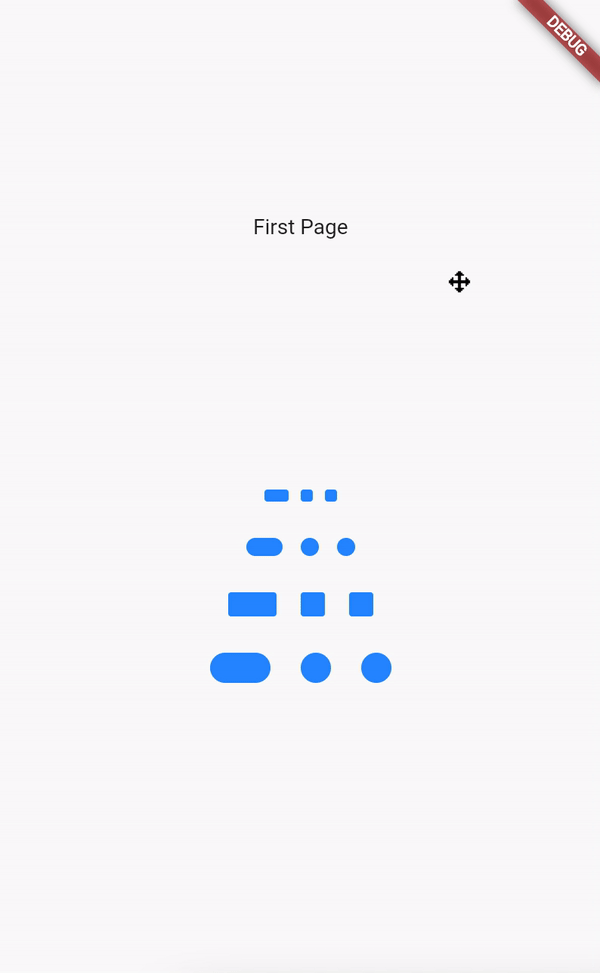

# page_view_sliding_indicator

A PageViews indicators with sliding effect when swipe

## Example:



This is how to use it, just need to pass the controller and how much page in your PageView
```
   PageViewSlidingIndicator(
              pageCount: 3,
              controller: controller,
              size: 8,
            )
 ```
